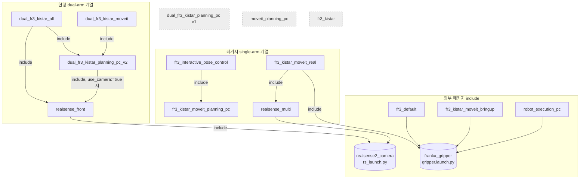

# `franka_kistar_bringup/launch` — Launch 파일 개요
Updated - 26.07.14. (Tue.) Chanyoung Ahn

이 디렉토리의 모든 `*.launch.py` 파일에 대해 **① 어떤 기능을 위해 실행되는지**,
**② 파일 간 의존 관계(include)**, **③ 유지/레거시 상태**를 정리한 문서입니다.

> 조사 기준일: 2026-07-14 (git 마지막 커밋 날짜 기준으로 최신성 판단)
> 현재 운영 대상은 **dual-arm(양팔) FR3 + KISTAR hand 시스템**이며,
> 단일팔(single-arm) 계열 launch는 대부분 그 이전 개발 산물(레거시)입니다.

> **2026-07-14 정리:** 현재 활용되지 않는 launch 10개는 `deprecated/` 하위로 이동했습니다
> (삭제가 아닌 이동 — git 히스토리 보존). `launch/` 최상위에는 현행 4개만 남습니다.
> `deprecated/` 상세와 되살리기(revive) 주의사항은 [`deprecated/README.md`](./deprecated/README.md) 참고.
>
> ⚠️ `setup.py`의 설치 glob은 `launch/*.launch.py`(비재귀)라서 **`deprecated/` 안의 파일은
> 더 이상 설치/`ros2 launch`(짧은 이름)로 실행되지 않습니다.** 이는 의도된 deprecation 동작입니다.

---

## 1. 한눈에 보기 (요약 표)

| Launch 파일 | 역할 | 계열 | 최종수정 | 위치 / 상태 |
|---|---|---|---|---|
| `dual_fr3_kistar_planning_pc_v2.launch.py` | **양팔 MoveIt 플래닝 스택의 핵심(v2 BRACKET)** | dual | 2026-07-07 | `launch/` ✅ **현행/핵심** |
| `dual_fr3_kistar_moveit.launch.py` | 양팔 MoveIt 전용(카메라 미포함) 래퍼 — split 워크플로우 step 1 | dual | 2026-07-07 | `launch/` ✅ 현행 (진입점) |
| `dual_fr3_kistar_all.launch.py` | 양팔 MoveIt + 전면 카메라 올인원 진입점 | dual | 2026-07-07 | `launch/` ✅ 현행 (진입점) |
| `realsense_front.launch.py` | 전면 D435i(전면 카메라) 단독 구동 드라이버 | camera | 2026-07-13 | `launch/` ✅ 현행 |
| `dual_fr3_kistar_planning_pc.launch.py` | 양팔 MoveIt 플래닝(v1, non-bracket) — **v2로 대체됨** | dual | 2026-06-23 | `deprecated/` 📦 (툴링 경로 갱신됨) |
| `robot_execution_pc.launch.py` | (분산) 실행측 PC — ros2_control + trajectory_subscriber | single(분산) | 2026-06-23 | `deprecated/` 📦 |
| `fr3_kistar_moveit_bringup.launch.py` | 단일팔 MoveIt + Shared-Memory 브릿지(P2P 모션) | single | 2026-05-23 | `deprecated/` 📦 |
| `fr3_kistar_moveit_planning_pc.launch.py` | 단일팔 (분산) 플래닝 PC — trajectory topic publish | single(분산) | 2026-05-23 | `deprecated/` 📦 |
| `fr3_interactive_pose_control.launch.py` | 단일팔 CUI EE-pose 입력 → MoveIt 플래닝 데모 | single | 2026-03-11 | `deprecated/` 📦 |
| `moveit_planning_pc.launch.py` | 범용 (분산) MoveIt 플래닝 PC | single(분산) | 2026-03-11 | `deprecated/` 📦 |
| `fr3_kistar_moveit_real.launch.py` | 단일팔 MoveIt + JointTrajectoryController 실로봇 실행 | single | 2026-02-03 | `deprecated/` 📦 |
| `realsense_multi.launch.py` | 다중 RealSense 헬퍼 — `realsense_front`로 대체됨 | camera | 2026-02-03 | `deprecated/` 📦 |
| `fr3_kistar.launch.py` | 단일팔 FR3+KISTAR 기본 bringup(ros2_control + RViz, MoveIt 無) | single | 2026-01-16 | `deprecated/` 📦 |
| `fr3_default.launch.py` | Franka 제공 데모(moveit_resources demo 개작) — 단일 fr3 | single | 2026-01-30 | `deprecated/` 📦 (참조 0) |

상태 범례: `launch/` ✅ 현행 · `deprecated/` 📦 2026-07-14 이동됨(미설치)

---

## 2. 의존 관계 (include 그래프)

`IncludeLaunchDescription` 으로 실제 런타임에 다른 launch 파일을 포함하는 관계만 표시합니다.
(`fr3_kistar.launch.py` 를 언급하는 다른 launch의 문장은 전부 **주석**이며 런타임 의존성이 아닙니다.)

- **standalone (내부 include 없음, 점선 박스):** `dual_fr3_kistar_planning_pc`(v1), `moveit_planning_pc`, `fr3_kistar`
- **외부 패키지 의존:** `realsense2_camera`(카메라 드라이버), `franka_gripper`(그리퍼) — 저장소 외부 ROS 패키지

### 진입점(top-level) vs 부품(included)
- **양팔 진입점:** `dual_fr3_kistar_all` (올인원) / `dual_fr3_kistar_moveit` (MoveIt만) → 둘 다 `_v2`를 감싼 얇은 래퍼
- **양팔 핵심 부품:** `dual_fr3_kistar_planning_pc_v2` (실질적인 모든 노드가 여기 정의됨)
- **공유 부품:** `realsense_front` (진입점에서 include 되기도 하고 단독 실행도 가능)

---

## 3. 파일별 상세

### ✅ 현행 dual-arm 스택

#### `dual_fr3_kistar_planning_pc_v2.launch.py` — 시스템의 심장
- **기능:** PC1(플래닝 PC)용 양팔 MoveIt 플래닝 + 실시간 트래킹. v2 **BRACKET 빌드**
  (`dual_fr3_kistar_v2.*` URDF/SRDF/yaml, `kistar_hand_base_bracket_15deg` 링크 포함).
- **실행 노드:** `robot_state_publisher`, `joint_state_publisher(_gui)`, `hand_gui_bridge.py`,
  `joint_state_merger.py`(L/R), `joint_states_observer.py`, `move_group`, `rviz2`,
  `planning_scene_static_boxes.py`, `trajectory_bridge.py`(L/R), static TF 다수.
- **의존:** `use_camera:=true` 시 `realsense_front.launch.py` include.
- **주요 인자:** `joint_state_mode`(fake/direct), `robot_ip`, `use_rviz`, `use_camera`,
  `camera_view`, `use_joint_state_gui`, `real_hand`, `hand_side`, `front_camera_*`, `table_*`.
- **참조처:** `dual_fr3_kistar_all`, `dual_fr3_kistar_moveit`(include),
  `pose_commander.py`, `current_ee_pose.py`, `docs/run/*`, `docs/setup/Run_robot.md`.

#### `dual_fr3_kistar_moveit.launch.py` — MoveIt 전용 진입점 (split step 1)
- **기능:** `_v2`를 감싼 얇은 래퍼. `use_camera:=false` 강제(카메라 드라이버 미기동 → RViz 가벼움),
  `camera_view:=true` 강제(카메라용 RViz 레이아웃, 카메라는 별도 실행 시 렌더). split 워크플로우 1단계.
- **의존:** `dual_fr3_kistar_planning_pc_v2.launch.py` include. 카메라는 `realsense_front`를 별도 터미널에서.

#### `dual_fr3_kistar_all.launch.py` — 올인원 진입점
- **기능:** MoveIt 스택 + 전면 RealSense를 한 명령으로. `_v2`(카메라 off) + `realsense_front`를 각각 include
  (카메라는 독립 프로세스라 MoveIt과 분리 재시작 가능).
- **의존:** `dual_fr3_kistar_planning_pc_v2.launch.py` + `realsense_front.launch.py`.
- **참조처:** `docs/run/run_real_moveit.md`.

#### `realsense_front.launch.py` — 전면 카메라 드라이버
- **기능:** 전면 D435i(serial `846112071515`) 단독 구동. `realsense2_camera/rs_launch.py` 래핑.
  TF root `front_camera_link` 를 world 하위 static TF에 체이닝.
- **의존:** 외부 `realsense2_camera`. 단독 실행 및 `_v2`/`_moveit`/`_all`에서 include 모두 가능.
- **비고:** 최근(2026-07-13) 갱신 — RealSense v4.56 프로파일 인자 이슈 대응
  (`rgb_camera.color_profile`/`depth_module.depth_profile`, 기본 640x480x15).

---

### 📦 v1 — `deprecated/`로 이동됨 (툴링 경로 갱신 완료)

#### `deprecated/dual_fr3_kistar_planning_pc.launch.py` — v1 (v2로 대체됨)
- **기능:** 양팔 MoveIt 플래닝의 **이전 버전(non-bracket)**. 노드 구성은 v2와 유사하나
  bracket URDF/SRDF/yaml 미사용. 현재는 `_v2`가 운영 표준.
- **⚠️ 삭제 주의 — 아직 활성 툴링이 v1을 대상으로 함:**
  - `test/test_validator.py` → v1의 `_validate_args` 를 import 하여 단위테스트
  - `scripts/lint_launch_args.sh` → **기본 `LAUNCH_FILE`이 v1**
  - `scripts/measure_launch_time.py` → v1 대상 probe
  - `scripts/regenerate_urdf.sh`, `scripts/joint_states_observer.py`, `docs/dev/dual_arm_dev_plan.md` (주석/문서 참조)
  - → 삭제하려면 위 툴링/테스트를 먼저 `_v2`로 마이그레이션 필요.

---

### 📦 레거시 single-arm / 분산 계열 — 모두 `deprecated/`로 이동됨

> 아래는 모두 **양팔 시스템 이전의 단일팔(또는 단일팔 분산) 개발 산물**로,
> 현행 dual-arm 워크플로우(`docs/run/run_real_moveit.md`)에서 사용되지 않습니다.
> 참조는 주로 `docs/run/etc/`(보조/구버전 문서)와 `docs/dev/kistar_ws_packages.md`에 국한됩니다.
> (파일 경로는 이제 모두 `deprecated/` 하위)

#### `fr3_default.launch.py` — 참조 0
- Franka 제공 데모(`moveit_resources/panda demo.launch.py` 개작). 단일 fr3 + `franka_gripper`.
- **저장소 어디에서도 참조되지 않음(참조 0).** 순수 보일러플레이트. 삭제 시 영향 없음.

#### `fr3_kistar.launch.py`
- 단일팔 FR3+KISTAR 기본 bringup (ros2_control + RViz, **MoveIt 없음**).
- 다른 launch에서의 언급은 전부 **주석**("from fr3_kistar.launch.py"). `docs/setup/Run_robot.md`에서만 언급.

#### `fr3_kistar_moveit_real.launch.py`
- 단일팔 MoveIt + `JointTrajectoryController` 실로봇 직접 실행. `realsense_multi` + `franka_gripper` include.
- 참조: `fr3_kistar_moveit_planning_pc`(주석), `docs/run/etc/*`, `docs/dev/kistar_ws_packages.md`.

#### `fr3_kistar_moveit_bringup.launch.py`
- 단일팔 MoveIt + Shared-Memory 브릿지(Point2Point 모션 생성기, `franka_kistar_isaac_moveit`의
  `isaac_moveit_bridge`/`real_moveit_bridge`). 헤더에 "obstacle avoidance 불가" 명시.
- 참조: `docs/dev/kistar_ws_packages.md`, `docs/run/etc/controller.md`.

#### `fr3_kistar_moveit_planning_pc.launch.py`
- 단일팔 **분산** 플래닝 PC: MoveIt으로 플래닝 후 `trajectory_forwarder.py`로 topic publish.
- **의존:** `fr3_interactive_pose_control`에서 include. `docs/dev/*`, `docs/run/etc/interactive_pose_control.md`.

#### `fr3_interactive_pose_control.launch.py`
- 단일팔 CUI 데모: target EE-pose 입력 → MoveIt 플래닝 → 확인 후 `/trajectory_commands` publish.
- **의존:** `fr3_kistar_moveit_planning_pc.launch.py` include + `pose_commander.py`. `docs/run/etc/`.

#### `moveit_planning_pc.launch.py`
- 범용(단일팔) **분산** MoveIt 플래닝 PC. `move_group` + `trajectory_forwarder.py`.
- 참조: `docs/run/etc/distributed_moveit_setup.md`, `docs/dev/*`.

#### `robot_execution_pc.launch.py`
- (분산) **실행측** PC: ros2_control(`ros2_control_node` + spawner) + `trajectory_subscriber.py` +
  `franka_gripper`. `moveit_planning_pc`/`fr3_kistar_moveit_planning_pc`의 실행측 짝.
- 참조: `docs/run/etc/interactive_pose_control.md`.

#### `realsense_multi.launch.py`
- 다중 RealSense를 한 번에 띄우는 헬퍼. 현행 워크플로우에서는 `realsense_front.launch.py`로 대체.
- **의존처:** `fr3_kistar_moveit_real.launch.py`(그 자체가 레거시). `docs/dev/kistar_ws_packages.md`.

---

## 4. `deprecated/` 이동 기록 (2026-07-14)

아래 10개 파일을 `git mv`로 **`deprecated/` 하위로 이동**했습니다(삭제 아님, 히스토리 보존).

### A. 참조 0 (가장 안전)
1. `fr3_default.launch.py` — 저장소 참조 0, Franka 보일러플레이트.

### B. single-arm / 분산 레거시 묶음
2. `fr3_kistar.launch.py`
3. `fr3_kistar_moveit_real.launch.py`
4. `fr3_kistar_moveit_bringup.launch.py`
5. `fr3_kistar_moveit_planning_pc.launch.py`  ← `fr3_interactive_pose_control`가 include
6. `fr3_interactive_pose_control.launch.py`
7. `moveit_planning_pc.launch.py`
8. `robot_execution_pc.launch.py`
9. `realsense_multi.launch.py`  ← `fr3_kistar_moveit_real`만 사용(그것도 레거시)

### C. v1 (기능은 v2로 대체됨, 툴링 경로 갱신 완료)
10. `dual_fr3_kistar_planning_pc.launch.py` (v1)
    - 이동에 맞춰 아래 툴링의 참조 경로를 `launch/deprecated/`로 갱신함:
      - `test/test_validator.py` (`LAUNCH_PY` 경로) — 이동 후 21 테스트 통과 확인
      - `scripts/lint_launch_args.sh` (기본 `LAUNCH_FILE`) — 이동 후 lint OK 확인
      - `scripts/measure_launch_time.py` (docstring을 v2 기준으로 갱신)

### 이동하지 않은 파일 (현행 4개, `launch/` 최상위 유지)
- `dual_fr3_kistar_planning_pc_v2.launch.py`
- `dual_fr3_kistar_moveit.launch.py`
- `dual_fr3_kistar_all.launch.py`
- `realsense_front.launch.py`

### 남은 정리(선택) / 주의사항
- **미설치:** `setup.py` glob(`launch/*.launch.py`, 비재귀)이라 `deprecated/` 파일은 빌드 시 설치되지 않음
  → `ros2 launch franka_kistar_bringup <deprecated 파일>` 은 더 이상 동작하지 않음(의도됨).
- **되살릴 경우:** `deprecated/` 내부 상호 include(예: `fr3_interactive_pose_control`→`fr3_kistar_moveit_planning_pc`,
  `fr3_kistar_moveit_real`→`realsense_multi`)는 `FindPackageShare(...)/launch/<file>` 로 install 공간을 가리키므로,
  되살리려면 (a) `setup.py`에 `launch/deprecated/*.launch.py` 설치 규칙 추가 + (b) include 경로에 `deprecated` 삽입이 필요.
- **문서 정리(미완, 선택):** `docs/run/etc/`(controller / distributed_moveit_setup / interactive_pose_control /
  moveit_real_robot_execution / moveit_trajectory_execution)와 `docs/dev/kistar_ws_packages.md`의
  `ros2 launch ...` 예시는 여전히 옛 경로/짧은 이름을 사용 → 필요 시 별도 갱신 권장.
